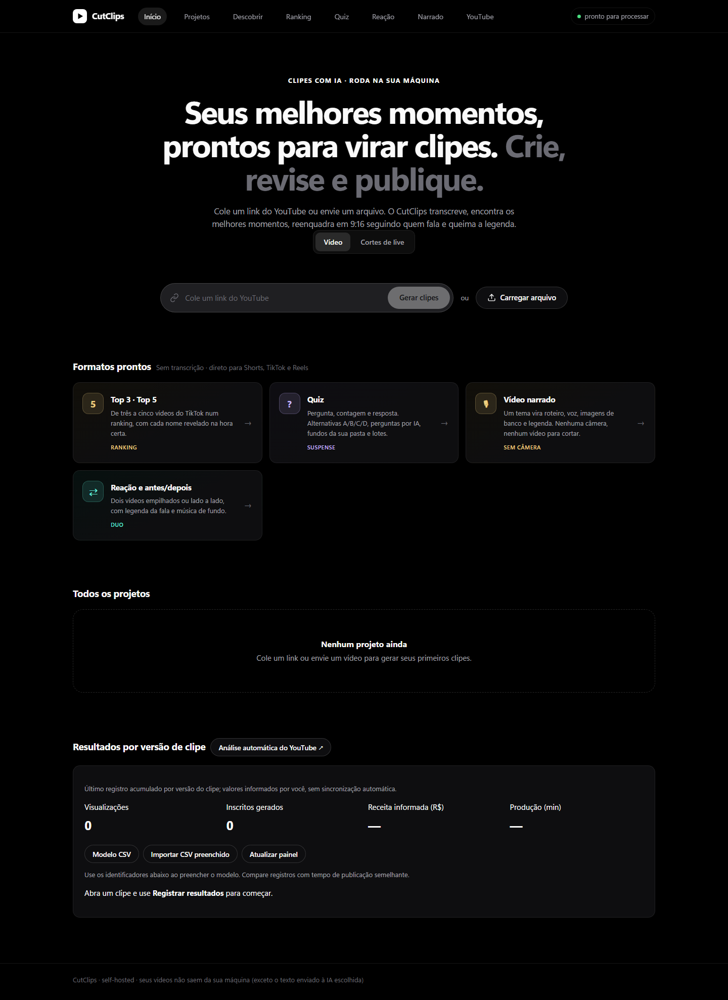
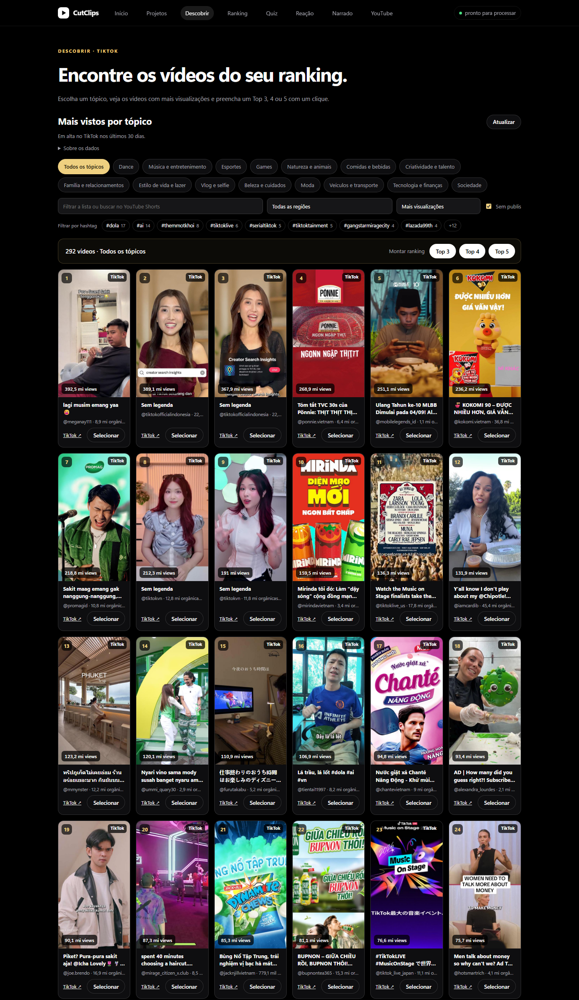
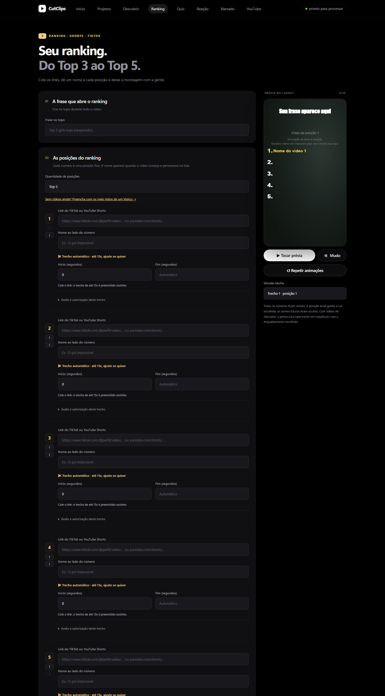
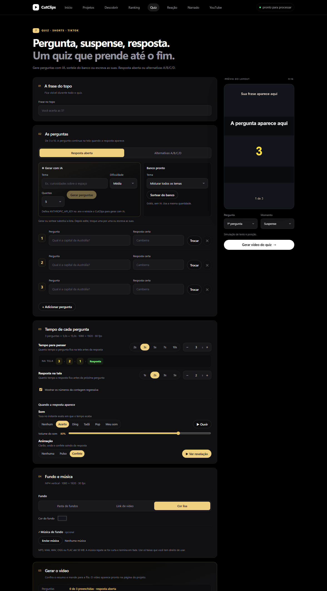
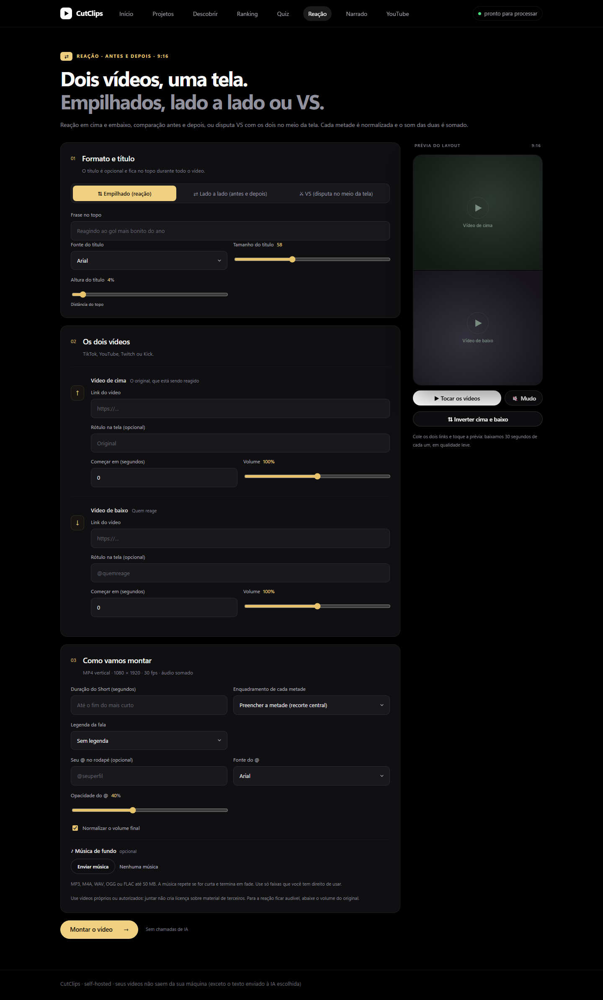
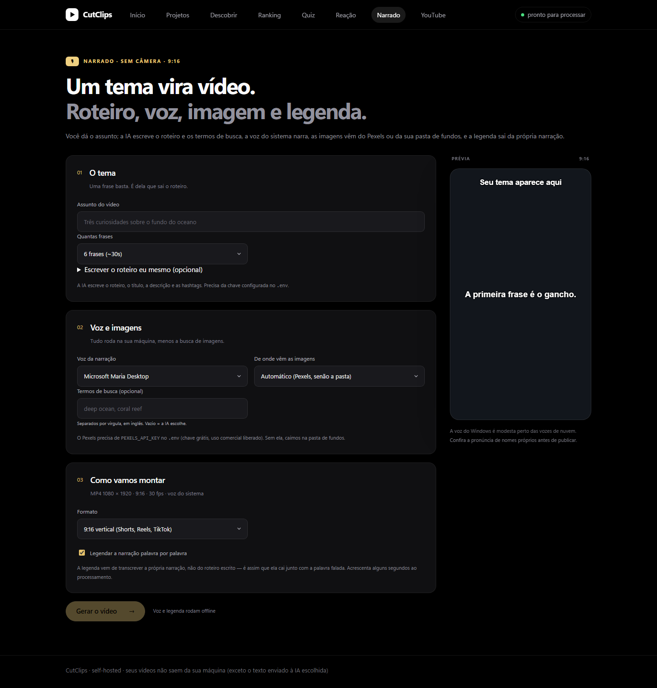
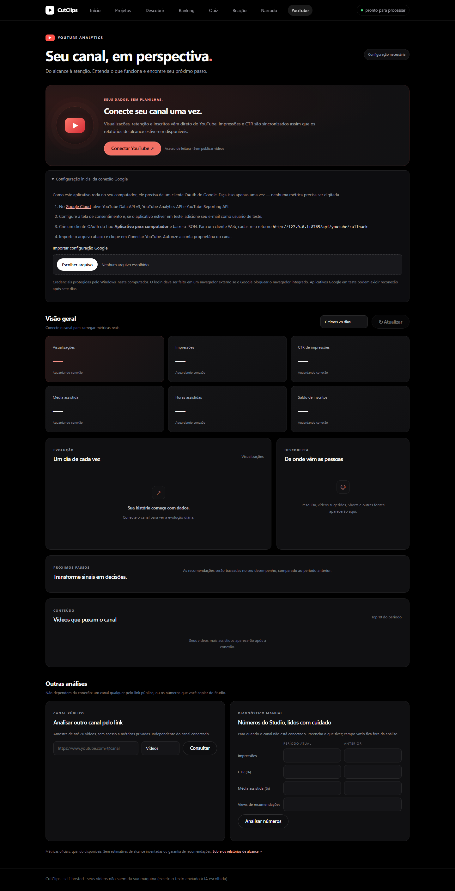
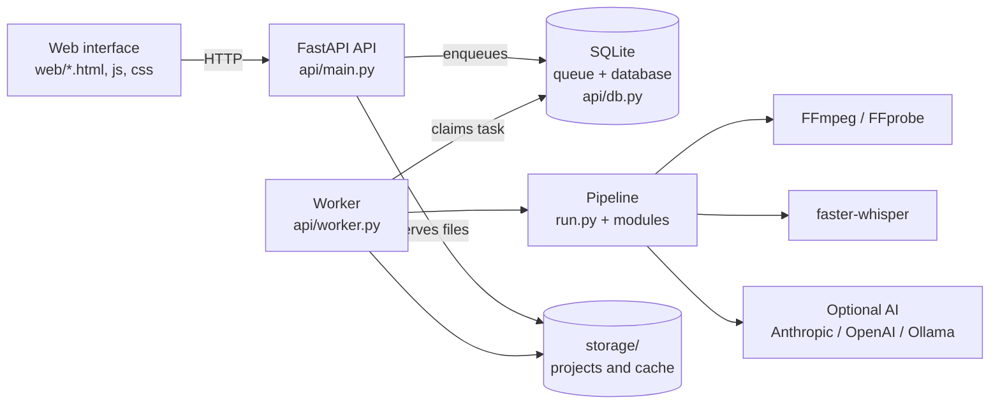
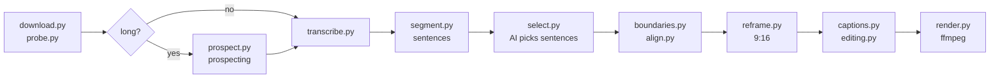

# CutClips

**English** | [Português](README.pt-BR.md)

> **Free, and not for sale.** CutClips is completely free to use, including to make money from the videos you create with it. What is not allowed is selling the platform itself: the software, copies or modified versions of it, or paid services built on it (such as hosting it for others). See the [license](#license).

> **Contributions are welcome.** Found a bug or have an idea? Open an [issue](https://github.com/CodaxiKing/CutClips/issues). Want to send an improvement? Fork the repository, create a branch, run the [tests](#tests) and open a [pull request](https://github.com/CodaxiKing/CutClips/pulls) (PR). By contributing, you license your contribution to the maintainer under the MIT License, while you keep its copyright; see [CONTRIBUTING.md](CONTRIBUTING.md).

**Long video → vertical clips → review → publishing package → results.**

A local, self-hosted app that turns long videos, livestreams and links into captioned vertical clips for Shorts, TikTok and Reels. It also builds ready-made formats: Top 3/4/5 rankings, suspense quizzes, side-by-side reactions and narrated videos from a topic. Built with Python, FastAPI, SQLite and FFmpeg, with a framework-free web interface.

Local editing keeps videos on your machine; text sent to your chosen AI provider for clip selection is an exception. Motion Control and Influencer IA use local ComfyUI workflows without per-generation credits; model weights must be installed locally.

> The interface is in Brazilian Portuguese. Interface labels are quoted as they appear on screen, with a translation alongside.



## Requirements to run locally

| | Required | Notes |
|---|---|---|
| **Operating system** | Windows 10 or 11 | The launchers are PowerShell scripts. On Linux/macOS, use [Docker](#docker) or run the API and the worker by hand |
| **Python** | 3.11 or newer | |
| **FFmpeg and FFprobe** | With libass, on `PATH` | Or the `static-ffmpeg` package inside `.venv`, which the scripts find on their own |
| **Git** | To clone | The folder must be named **`cutclips`**, lowercase: it is the Python package name |
| **Disk space** | A few free GB | The default transcription model (`large-v3`) is downloaded on first run |
| **AI for clip selection** | Optional | An Anthropic or OpenAI key, or a local Ollama. With none, use the **Sem IA** (no AI) mode |
| **NVIDIA GPU** | Optional | Speeds up transcription and encoding (NVENC) |
| **Pexels key** | Optional | Images for narrated videos. Without it, the backgrounds folder is used |
| **Google Cloud account** | Optional, **Windows only** | To connect your YouTube channel: credentials are protected by Windows DPAPI |

Quick install:

```powershell
git clone https://github.com/CodaxiKing/CutClips.git cutclips
cd cutclips
python -m venv .venv
.venv\Scripts\python.exe -m pip install -r requirements.txt
copy .env.example .env
```

Then double-click **`Iniciar CutClips.cmd`**. Details in [How to run](#how-to-run).

## Contents

- [Tour of the tabs](#tour-of-the-tabs)
- [How to run](#how-to-run)
- [Configuration (.env)](#configuration-env)
- [Architecture](#architecture)
- [Modules](#modules)
- [Project workflow](#project-workflow)
- [Feature details](#feature-details)
- [Performance](#performance)
- [Reliability](#reliability)
- [Tests](#tests)
- [Content and monetization](#content-and-monetization)
- [License](#license)

---

## Tour of the tabs

### Início (Home): long video or livestream → clips


Paste a YouTube link or upload a file. CutClips transcribes it, finds the best moments, reframes to 9:16 following whoever is speaking, and burns in the captions. The **Vídeo / Cortes de live** (Video / Livestream cuts) toggle switches to Twitch, Kick and YouTube streams (VOD, clip or an ongoing live), with 16:9 or 9:16 output.

The same page also has:
- **Formatos prontos** (Ready-made formats): shortcuts to Ranking, Quiz, Narrated and Reaction.
- **Todos os projetos** (All projects): each project opens its own page (`#/job/<id>`) with the generated clips, the editor (**Revisar e editar**, "Review and edit"), publishing preparation and the package download.
- **Resultados por versão de clipe** (Results per clip version): a dashboard of metrics you enter yourself, with a CSV template and import.

### Descobrir (Discover): trending videos for your ranking



Lists the most-viewed TikTok videos by topic, with filters for region, hashtag and sort order. Select three to five and use **Top 3 / Top 4 / Top 5** to fill in the ranking editor. It also offers dance searches (choreography, song, hashtag) and a list of **candidates** saved in your browser, organized by collection.

### Ranking: Top 3, Top 4 or Top 5



TikTok or YouTube Shorts links, a caption pinned to the top and a name for each position. The numbers are visible from the first frame, and each name is revealed when that position's video starts. The preview on the side simulates text, placement and animations. Each clip accepts a start and end, and each position lets you keep, mute or replace the audio and upload a voice-over. **No transcription and no paid AI calls**: it is download, trim and assembly.

### Quiz: question, suspense, answer



Three to ten questions, with open answers or A/B/C/D options. Questions can be generated by AI (and reviewed before reaching the screen), drawn from a free local question bank, or written by hand. You set the thinking time, the countdown, the reveal sound and animation, and pick the background: videos from a folder of yours, a link or a solid color, with optional music.

### Reação (Reaction): two videos, one screen



Three layouts: **stacked** (reaction), **side by side** (before and after) and **VS** (face-off in the middle of the screen). Each half is normalized and the audio of both is mixed. Optional title, labels, per-video volume, speech captions, your @ handle in the footer and background music. No AI calls.

### Narrado (Narrated): a topic becomes a video



You give the subject. The AI writes the script and the search terms, the system voice narrates, images come from Pexels or your backgrounds folder, and the captions come from transcribing the narration itself, so they land on the spoken word. No camera and no footage to cut.

### YouTube: channel analytics



Everything YouTube lives on one page:
- **Your connected channel:** views, impressions, CTR, average percentage viewed, watch hours and net subscribers, compared with the previous period, plus daily trend, traffic sources, next steps and the 10 videos driving the channel. Data comes straight from YouTube via OAuth, with read-only access.
- **Public channel:** a sample of up to 20 videos from any channel by its link, without private metrics.
- **Manual diagnosis:** for when the channel is not connected. You enter your Studio numbers (current vs. previous period) and get a careful reading, without promising a cause or a guaranteed recommendation.

See [Connecting a Google account](#connecting-a-google-account-windows).

---

## How to run

Check the [requirements](#requirements-to-run-locally) first.

### Windows: double-click

```powershell
git clone https://github.com/CodaxiKing/CutClips.git cutclips
cd cutclips
python -m venv .venv
.venv\Scripts\python.exe -m pip install -r requirements.txt
copy .env.example .env
```

Then double-click **`Iniciar CutClips.cmd`**. It starts the API and the worker in the background, waits for the server to respond and opens http://127.0.0.1:8000.

> Do not open `web/index.html` directly in the browser: the page depends on the API. If that happens, it redirects itself to `http://127.0.0.1:8000/`.

### Windows: two terminals

```powershell
# Terminal 1: API + interface
powershell -ExecutionPolicy Bypass -File scripts/start.ps1 -Mode api

# Terminal 2: processing and edit queue
powershell -ExecutionPolicy Bypass -File scripts/start.ps1 -Mode worker
```

Open http://127.0.0.1:8000. The API and the worker must use the same `CUTCLIPS_STORAGE`. Without the worker, projects are queued but never processed.

### Docker

```bash
cp .env.example .env
docker compose up --build
```

The API receives uploads and serves files; the worker downloads, transcribes and renders. For more workers: `docker compose up -d --scale worker=3`. `docker-compose.yml` has an NVIDIA GPU block commented out, ready to enable.

> There is no user authentication. Keep the interface reachable only from your machine or a trusted network.

### Upgrading from a version called ClipForge

The project used to be called ClipForge. Nothing you already have is lost:

- **Folder:** rename `clipforge` to `cutclips`. Imports are now `cutclips.*`.
- **Database:** if only `storage/clipforge.db` exists, it keeps being used in place. New installs create `storage/cutclips.db`.
- **Variables:** a `.env` or `docker-compose.yml` with `CLIPFORGE_*` keeps working. Switch to `CUTCLIPS_*` when you can.
- **Browser:** preferences and candidates saved under the old keys are still read.

### Command line (no interface)

```bash
python -m cutclips.run interview.mp4 -o ./output -n 5 --min 20 --max 60 --niche technology --audience beginners
python -m cutclips.run interview.mp4 -o ./output --provider heuristic --layout fit --denoise
```

### Why `-P`?

The project has a module named `select.py`, which shares its name with a standard-library module. If the repository root lands on `sys.path` before the stdlib, Python imports the wrong file and breaks. The scripts run with `python -P` (which keeps the current folder off the path) and through `scripts/launch.py`, which loads the native `select` first. Do the same when running anything by hand from the root.

---

## Configuration (.env)

The app loads `.env` on its own, without overwriting variables already set in the environment. The main ones:

| Variable | Default | Purpose |
|---|---|---|
| `CUTCLIPS_LLM_PROVIDER` | `anthropic` | `anthropic`, `openai`, `ollama` or `heuristic` (no AI) |
| `CUTCLIPS_LLM_MODEL` | `claude-sonnet-4-5` | Selection model. Can also be chosen in the interface |
| `CUTCLIPS_TRIAGE_MODEL` / `CUTCLIPS_REVIEW_MODEL` | — | Separate models for block triage and final review |
| `ANTHROPIC_API_KEY` / `OPENAI_API_KEY` / `OLLAMA_HOST` | — | Credentials for the chosen provider |
| `CUTCLIPS_WHISPER_MODEL` | `large-v3` | `tiny` to `large-v3` |
| `CUTCLIPS_WHISPER_DEVICE` | `auto` | `auto`, `cuda` or `cpu` |
| `CUTCLIPS_WHISPER_BEAM` | `0` | 0 = automatic (2 on CPU, 5 on GPU) |
| `CUTCLIPS_LANGUAGE` | empty | Empty = auto-detect |
| `CUTCLIPS_MAX_CLIPS` | `10` | Maximum clips per video |
| `CUTCLIPS_MIN_DURATION` / `CUTCLIPS_MAX_DURATION` | `20` / `90` | Clip length, in seconds |
| `CUTCLIPS_VIDEO_ENCODER` | `auto` | `auto`, `nvenc`, `qsv`, `amf` or `cpu` |
| `CUTCLIPS_CRF` / `CUTCLIPS_PRESET` | `19` / `medium` | Encoding quality and speed |
| `CUTCLIPS_LIVE_MINUTES` | `30` | Recording window for an ongoing livestream |
| `CUTCLIPS_PROSPECT_AFTER_MINUTES` | `25` | Above this, the video is prospected before transcription |
| `CUTCLIPS_SAFE_AREA` / `CUTCLIPS_CENTER_BIAS` | `0.5` / `0.25` | Vertical framing |
| `CUTCLIPS_FACE_MODEL` | — | Path to a `face_detection_yunet*.onnx` for neural-network face detection |
| `CUTCLIPS_STORAGE` | `./storage` | SQLite database, projects and caches |
| `PEXELS_API_KEY` | — | Images for narrated videos. Without it, the backgrounds folder is used |
| `YOUTUBE_CLIENT_ID` / `YOUTUBE_CLIENT_SECRET` | — | YouTube OAuth. Alternative: import the JSON in the interface |
| `HF_TOKEN` | — | Speaker diarization with `pyannote` (optional) |

The full, commented list is in [`.env.example`](.env.example). Names with the old `CLIPFORGE_` prefix are still accepted; when both exist, `CUTCLIPS_` wins.

---

## Architecture



The API is lightweight: it receives files, enqueues work and serves results. All heavy lifting happens in the worker, a separate process. Several workers can share the queue.

### Pipeline for a long video



---

## Modules

### Core: long video → vertical clips

In the order the pipeline uses them:

| Module | What it does |
|---|---|
| [`run.py`](run.py) | Orchestrator: long video → N captioned vertical clips. Also the CLI entry point |
| [`download.py`](download.py) | Download by URL (YouTube, Twitch, Kick) via yt-dlp |
| [`probe.py`](probe.py) | Media metadata via ffprobe |
| [`prospect.py`](prospect.py) | Prospects moments in long streams: only the windows around the peaks go to transcription |
| [`transcribe.py`](transcribe.py) | Word-level timestamped transcription (faster-whisper), with caching |
| [`segment.py`](segment.py) | Words → numbered sentences |
| [`select.py`](select.py) | Clip selection: the LLM picks sentence IDs and the code computes the seconds |
| [`boundaries.py`](boundaries.py) | Refines the cut points |
| [`align.py`](align.py) | Local alignment of corrected caption boundaries |
| [`signals.py`](signals.py) | Cheap audiovisual signals used to audit the first two seconds of a clip |
| [`media_index.py`](media_index.py) | Persistent multimodal index shared by selection, reframing and captions |
| [`reframe.py`](reframe.py) | 16:9 → 9:16 reframing, face tracking and active-speaker estimation |
| [`captions.py`](captions.py) | ASS captions with word-by-word highlighting (karaoke style) |
| [`editing.py`](editing.py) | Internal edit decisions (pause and filler cuts) and timeline remapping |
| [`editor.py`](editor.py) | Renders a revision reusing the cached transcript |
| [`render.py`](render.py) | Builds and runs the final ffmpeg command |

### Montage formats

| Module | What it does |
|---|---|
| [`montage.py`](montage.py) | Pieces shared by the vertical montages (ranking, quiz, reaction) |
| [`topfive.py`](topfive.py) | Vertical ranking with three to five TikTok or YouTube Shorts clips |
| [`quiz.py`](quiz.py) | Suspense quiz: question, countdown, answer |
| [`quiz_ai.py`](quiz_ai.py) | AI-generated questions, reviewed before reaching the screen |
| [`quiz_bank.py`](quiz_bank.py) | Local question bank (free, no AI) |
| [`backgrounds.py`](backgrounds.py) | Backgrounds folder: videos dropped in a folder that the app uses on its own |
| [`sounds.py`](sounds.py) | Short reveal sounds, synthesized by ffmpeg itself |
| [`reaction.py`](reaction.py) | Reaction and comparison: two videos in a single vertical frame |
| [`narrate.py`](narrate.py) | Narrated video from a topic: script, voice, images and captions |

### Support

| Module | What it does |
|---|---|
| [`config.py`](config.py) | Central configuration; everything can be overridden by environment variables |
| [`diagnostics.py`](diagnostics.py) | Turns an exception into a message that says what to do |

### `api/`: HTTP backend and queue

| Module | What it does |
|---|---|
| [`api/main.py`](api/main.py) | HTTP API: uploads, projects, files and packages. It only receives, enqueues and serves |
| [`api/worker.py`](api/worker.py) | Queue worker, runs as a separate process |
| [`api/db.py`](api/db.py) | SQLite as queue and database: jobs, stages, versions and metric snapshots |
| [`api/studio.py`](api/studio.py) | Editing, publishing drafts and performance records |
| [`api/montages.py`](api/montages.py) | Quiz, reaction and narrated routes |
| [`api/topfive.py`](api/topfive.py) | Ranking routes |
| [`api/topfive_tools.py`](api/topfive_tools.py) | Per-position audio, factual review, source history and publishing reports |
| [`api/trending.py`](api/trending.py) | Most-viewed TikTok videos by topic, to fill a ranking |
| [`api/preview.py`](api/preview.py) | A lightweight excerpt of a link, so the interface preview plays the real video |
| [`api/channel.py`](api/channel.py) | Public channel sample and manual diagnosis from Studio numbers |
| [`api/youtube.py`](api/youtube.py) | YouTube analytics authorized by the channel owner; credentials never leave the backend |

### `web/`: interface

[`index.html`](web/index.html) and [`theme.css`](web/theme.css) are the base. Each screen has a JS and CSS pair:

| Screen | Files |
|---|---|
| Projects, editor and publishing | [`studio.js`](web/studio.js), [`studio.css`](web/studio.css) |
| Discover | [`discover.js`](web/discover.js), [`discover.css`](web/discover.css) |
| Ranking | [`topfive.js`](web/topfive.js), [`topfive.css`](web/topfive.css), [`topfive-tools.js`](web/topfive-tools.js), [`topfive-tools.css`](web/topfive-tools.css) |
| Quiz and Reaction | [`montages.js`](web/montages.js), [`montages.css`](web/montages.css) |
| Narrated | [`narration.js`](web/narration.js) |
| YouTube | [`channel.js`](web/channel.js), [`channel.css`](web/channel.css) |

### `scripts/`

| Script | What it does |
|---|---|
| [`start-all.ps1`](scripts/start-all.ps1) | Starts the API and the worker in the background and opens the browser. It is what `Iniciar CutClips.cmd` calls |
| [`start.ps1`](scripts/start.ps1) | Starts only the API (`-Mode api`) or only the worker (`-Mode worker`), finding the `.venv` Python and FFmpeg |
| [`launch.py`](scripts/launch.py) | Entry point for both, without letting `select.py` shadow the stdlib |

---

## Project workflow

1. Upload a video and enter the subject and audience. Use your own content or content you have the rights to.
2. Check which selection method was actually used and any warnings on the generated clips.
3. Open **Revisar e editar** (Review and edit), set the boundaries, correct words and adjust the layout.
4. Save and wait for the worker. Rendering creates a new version; if it fails, the previous one is still available.
5. In **Preparar publicação** (Prepare publishing), adjust the title and description, pick the thumbnail and approve.
6. Download the package and publish through YouTube Studio. Record the link after publishing.
7. Use **Registrar resultados** (Record results) to track views, average percentage viewed, subscribers, revenue in BRL and production minutes.

The planned date organizes your work locally; it does not schedule a YouTube upload. Publishing stays manual.

### What you can do in a project

- Transcribe once, keeping pauses, questions, emphasis and speaker changes, and reuse the cache across analyses and edits.
- Summarize long videos into 3–5 minute thematic blocks and analyze only the most promising ones.
- Classify the video type (podcast, interview, tutorial, lecture, vlog, gameplay, news or review) and adapt the cutting rules to it.
- Re-score clips after the duration adjustment. The score is editorial, not a view-count prediction.
- Know why the AI was not used: the project warns prominently and says what to fix, instead of silently falling back to heuristics.
- Review start and end against the original video and correct each word while keeping its timestamps.
- Re-render only the changed clip. The previous version stays available.
- Choose manual framing, face tracking, speaker estimation, split screen or the full frame over a blurred background.
- Adjust caption size, position, words per line and style. Low-confidence words are flagged.
- Normalize loudness, control peaks and reduce noise.
- Remove long internal pauses and isolated filler words, keeping audio, video, camera and captions in sync.
- Pick one of three thumbnails and organize clips as draft, approved or published.
- Download the MP4, SRT, thumbnail, publishing text and manifest as a ZIP, per clip or only the approved ones.

### Metrics and versions

Use cumulative values, not the daily increment. To correct a record, submit the same date and version again. Unknown fields stay empty: missing revenue does not mean zero revenue.

The CSV accepts the columns from the **Modelo CSV** (CSV template) button, in UTF-8, comma-separated, with `YYYY-MM-DD` dates and dot decimals. Limits: 2 MB and 1,000 rows. The whole file is validated before anything is written.

A new edit goes back to draft. Files, publishing metadata and metrics of the previous version are kept.

---

## Feature details

### Livestream cuts (Twitch, Kick, YouTube)

The **Cortes de live** mode on the home screen takes VODs, clips and live channels from all three platforms. An ongoing stream is recorded from now on, for the chosen window. Recording happens in real time, so 30 requested minutes mean a 30-minute wait. VODs and clips are downloaded normally.

Above `CUTCLIPS_PROSPECT_AFTER_MINUTES` (25 min by default), the video is **prospected** before transcription. An audio-only pass measures how much each moment rises above the norm for that stretch, adds scene changes and returns the peaks. Only the windows around those peaks go to Whisper. On a 6-hour VOD, this trades hours of GPU time for a few minutes. A stream with no reactions at all (tutorial, music) falls back to probes spread across the video.

Output is chosen per project: **16:9 horizontal**, which keeps the whole gameplay frame, or **9:16 vertical**, which uses face tracking.

### Ranking (Top 3, 4 or 5)

Accepts public TikTok links (including `vm.tiktok.com` and `vt.tiktok.com`) and YouTube Shorts. The result is a vertical 1080×1920 MP4 at 30 fps.

- The order is configurable: `1 → 5` or countdown `5 → 1`. The position being shown is highlighted.
- Horizontal, vertical and square sources can be mixed: *full video over a blurred background* or *fill the screen with a center crop*. A source without audio gets a silent track, so the join does not throw the sound out of sync.
- **Áudio e autorização deste trecho** (Audio and permission for this clip): per position, you can keep, mute or replace the audio, adjust the volume and upload a voice-over (WAV/MP3/M4A/OGG/FLAC/AAC, up to 25 MB). The background ducks automatically while the voice-over plays.
- The editor checks project history by link or ID and warns about repeats. New montages store the SHA-256 of their sources.
- **Revisar e baixar** (Review and download) shows duration, resolution, FPS, audio presence, sources, declared permissions, warnings and history before downloading. There is no Content ID check and no automatic license confirmation.
- **Acompanhamento após publicar** (Post-publishing tracking) stores manual lookups by date (link, restrictions, views, feed impressions, viewed percentages).

Limits: 10 minutes per source, 15 minutes in the result, 500 MB per download. The ZIP includes the MP4, thumbnail, manifest and a credits file with the source links.

### Discover

Trending videos come from TikTok's official trend center, which may require a login; there is no aggregated worldwide ranking. The search country is appended to the search text, without guaranteeing where creators are located. The candidate list lives in this browser's storage, for this address/port. A ranking that is already filled in asks for confirmation before being replaced.

### Vertical framing

- **Smooth, centered face** prefers keeping the camera centered, locks the crop when the face is stable and uses a 30-point-per-second trajectory with a speed limit. The preference for the center only holds while the face stays inside the safe area (`CUTCLIPS_SAFE_AREA`). Fine-tuning: `CUTCLIPS_CENTER_BIAS`, `CUTCLIPS_STATIONARY_THRESHOLD`, `CUTCLIPS_MAX_PAN_SPEED`, `CUTCLIPS_HOLD_SECONDS` and `CUTCLIPS_MOTION_FPS`.
- Detection uses frontal and profile cascades, discards boxes that are too small and holds the framing when the face disappears for more than a second. For difficult footage (low light, side profile, wide shot), point `CUTCLIPS_FACE_MODEL` to a `face_detection_yunet*.onnx` from the OpenCV Zoo.
- The camera prefers one continuous movement over several corrections. When the subject moves back and forth between recurring positions, tracking stops instead of following the sway (`CUTCLIPS_LINEAR_TOLERANCE`).
- A stretch with no face (gameplay, slides, screen share) follows the vertical band with the most motion and detail, and the clip says so. `CUTCLIPS_MIN_FACE_COVERAGE` sets how often a face must appear for tracking to be considered reliable.
- **Active-speaker estimation** combines lip activity with audio and waits before switching participants. It is experimental: for podcasts with several participants, review it or prefer split screen.
- Low-resolution clips are upscaled; exporting at 1080×1920 does not recover missing detail.

### Contextual analysis and learning

The YouTube title, description, channel and tags are used as context and as a glossary for proper names. Each sentence records pauses, questions, vocal energy, pitch, emphasis, topic changes and, when available, the speaker. Long videos are summarized into blocks in a single call, and a second call picks candidates only from the best blocks. The final review extends or shortens the range by whole sentences and rejects cuts that depend on missing context or have no conclusion.

The score separates hook, clarity, emotion or usefulness, density, title potential, retention, conclusion, and penalties for repetition, intros and advertising. `analysis.json` stores the candidates with a signature of the video, model, audience and learned profile, so identical calls are not repeated.

After five clips with metrics, the worker builds an aggregate profile of the best durations, formats and criteria. The profile only influences the weights, within conservative limits, and publishes its confidence in the manifest.

Local speaker separation uses energy, pitch, zero crossings and a spectral signature. For more accuracy, install `pyannote.audio`, accept the terms of `pyannote/speaker-diarization-3.1` on Hugging Face and set `HF_TOKEN`. `CUTCLIPS_DIARIZATION=0` turns both off.

Automatic editing removes pauses longer than `CUTCLIPS_INTERNAL_SILENCE_SECONDS` and isolated filler words surrounded by pauses, and a short zoom hides the edit points.

### Connecting a Google account (Windows)

1. In Google Cloud, enable **YouTube Data API v3**, **YouTube Analytics API** and **YouTube Reporting API**.
2. Set up the OAuth consent screen. In testing mode, add your account as a test user.
3. Create an OAuth client of type **Desktop app**, download the JSON and import it in the **YouTube** tab. With a Web client, register exactly the redirect address shown by the app (e.g. `http://127.0.0.1:8000/api/youtube/callback`).
4. Click **Conectar YouTube** (Connect YouTube). Your default browser opens the Google sign-in; choose the account that owns the channel and grant the two read-only scopes. There is no permission to upload or change videos.

Credentials and refresh tokens are encrypted with Windows DPAPI in `storage/youtube-credentials.bin`. Do not copy that file to another Windows user. **Desconectar** (Disconnect) revokes the token with Google and deletes the local connection data.

Impressions and CTR come from the official `channel_reach_basic_a1` report, created automatically when needed. The first reports can take up to 48 hours. The dashboard shows partial coverage and only compares reach when both periods are complete. Collection depends on the app being open: there is no background scheduling.

References: [OAuth for installed apps](https://developers.google.com/identity/protocols/oauth2/native-app), [reach reports](https://developers.google.com/youtube/reporting/v1/reports/channel_reports#reach-reports) and [generating reports](https://developers.google.com/youtube/reporting/v1/reports).

---

## Performance

### Where the time goes

Measured on a 231-second 1080p video, without a GPU, on eight cores. `0.25x` means fifteen seconds of work per minute of video.

| Stage | Time | Ratio |
| --- | --- | --- |
| audio envelope (prospecting) | 0.1 s | 0.00x |
| visual index (scenes, 0.5 fps) | 5.8 s | 0.03x |
| transcription | 44 s | 0.19x |
| media index (faces, 1 Hz) | 57.5 s | 0.25x |
| **rendering, per clip** | **82 s** (45-second clip) | **1.8x** |

Rendering dominates because it is the only stage that multiplies by the number of clips. Each clip goes through two encodes: the base (crop, camera, internal cuts) and then the caption burn-in. This is deliberate: the base is cached, so correcting a word re-renders only the second pass, which is much cheaper. With a GPU, `CUTCLIPS_VIDEO_ENCODER=nvenc` pays off far more than tweaking `CUTCLIPS_PRESET` and `CUTCLIPS_CRF`.

### Transcription

60 seconds of Portuguese speech, `small` model in `int8`, eight cores:

| Configuration | Time | Speed |
| --- | --- | --- |
| beam 5, library threads | 17.1 s | 3.5x |
| beam 5, 8 threads | 15.2 s | 4.0x |
| beam 1, 8 threads | 12.3 s | 4.9x |
| **beam 2, 8 threads (default)** | **11.4 s** | **5.3x** |

All of them returned the same text, word for word. With noisy audio the difference may show, which is why `CUTCLIPS_WHISPER_BEAM` stays configurable (and goes back to 5 on a GPU).

---

## Reliability

- Uploads stay in the `uploading` state, in a `.part` file, until the copy finishes. Only then are they queued. Default limit: 4 GB (`CUTCLIPS_MAX_UPLOAD_BYTES`).
- The queue uses SQLite transactions. Workers renew a lease through a heartbeat, abandoned tasks are recovered, and tokens stop an old worker from completing a task that another one has taken over. Only one edit per project is processed at a time.
- Each project has independent stages (transcription, analysis, tracking, rendering) in `pipeline_stages`, each with its own lease. Several workers can process different projects without repeating a completed stage.
- Incremental rendering keeps the caption-free vertical video, the three thumbnails and the trajectory. A text-only change just reapplies the captions.
- The transcription cache checks the file, size, modification date, model and language. The Whisper model stays loaded in the worker.
- AI errors trigger an explicitly labeled fallback, with the provider actually used recorded in the manifest.

---

## Tests

```powershell
.venv\Scripts\python.exe -m pip install -r requirements-dev.txt
.venv\Scripts\python.exe -P -m pytest -q
```

The suite generates synthetic media and uses real FFmpeg, without downloading models or making paid calls. `pytest.ini` runs `test_api`, `test_engine`, `test_topfive`, `test_montages`, `test_trending` and `test_narration`. The YouTube integration tests are not on that list and run like this:

```powershell
.venv\Scripts\python.exe -P -m pytest tests/test_channel.py tests/test_youtube.py -q
```

They cover configuration, origin protection, PKCE, callback, refresh, revocation, CTR weighting, caching and unavailable reports, without real access to Google.

Browser test (Playwright): `tests/serve_ui.py` starts an isolated database, `tests/serve_ui.py --worker` processes the edits and `node tests/ui_smoke.cjs` walks through review, publishing and metrics. Screenshots go to `tests/artifacts`.

---

## Content and monetization

The AI selection instructions favor preserved context, faithful titles, original examples and editorial variety. That does not certify originality: review the material and your rights to it before publishing.

The system helps with production; monetization depends on the content, the channel and YouTube's policies. Captions and cuts alone do not make reused material eligible, and assembling third-party videos does not grant you a license to them. See the [official policies](https://support.google.com/youtube/answer/1311392?hl=en).

---

## License

[MIT with the Commons Clause](LICENSE). In short:

- **Allowed:** using CutClips for free, for personal or commercial purposes, including making money from the videos you create; studying, modifying and sharing the code for free.
- **Not allowed:** selling CutClips, or offering for a fee a product or service whose value comes from it, such as selling copies, modified versions, or paid hosting or support.

This summary does not replace the [LICENSE](LICENSE) file, which is what applies.
