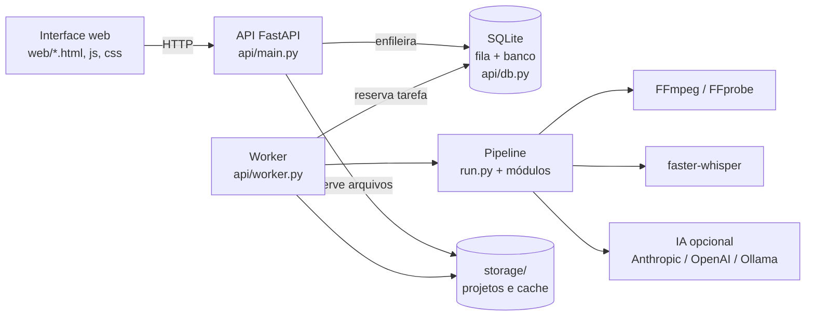
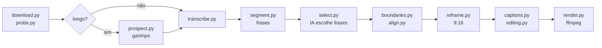

# CutClips

**Português** | [English](README.md)

> **Gratuito, e proibida a venda.** O CutClips é totalmente gratuito, inclusive para ganhar dinheiro com os vídeos que você cria com ele. O que não é permitido é comercializar a plataforma: vender o software, cópias ou versões modificadas, ou serviços pagos baseados nele (como hospedá-lo para terceiros). Veja a [licença](#licença).

> **Contribuições são bem-vindas.** Encontrou um bug ou tem uma ideia? Abra uma [issue](https://github.com/CodaxiKing/CutClips/issues). Quer enviar uma melhoria? Faça um fork do repositório, crie uma branch, rode os [testes](#testes) e abra um [pull request](https://github.com/CodaxiKing/CutClips/pulls) (PR). Ao contribuir, você concorda que sua contribuição fica sob a mesma [licença](#licença) do projeto.

**Vídeo longo → clipes verticais → revisão → pacote de publicação → resultados.**

Aplicativo local (self-hosted) que transforma vídeos longos, lives e links em clipes verticais legendados para Shorts, TikTok e Reels, e também monta formatos prontos: ranking Top 3/4/5, quiz com suspense, reação lado a lado e vídeo narrado a partir de um tema. Feito em Python, FastAPI, SQLite e FFmpeg, com interface web sem framework.

Seus vídeos não saem da sua máquina. A exceção é o texto enviado à IA que você escolher.


## Requisitos para rodar localmente

| | Necessário | Observação |
|---|---|---|
| **Sistema** | Windows 10 ou 11 | Os lançadores são PowerShell. Em Linux/macOS, use o [Docker](#docker) ou rode a API e o worker à mão |
| **Python** | 3.11 ou mais novo | |
| **FFmpeg e FFprobe** | Com libass, no `PATH` | Ou o pacote `static-ffmpeg` dentro da `.venv`, que os scripts encontram sozinhos |
| **Git** | Para clonar | A pasta precisa se chamar **`cutclips`**, em minúsculo: ela é o nome do pacote Python |
| **Espaço em disco** | Alguns GB livres | O modelo de transcrição padrão (`large-v3`) é baixado na primeira execução |
| **IA para a seleção** | Opcional | Chave da Anthropic ou da OpenAI, ou um Ollama local. Sem nenhuma, use o modo **Sem IA** |
| **GPU NVIDIA** | Opcional | Acelera a transcrição e a codificação (NVENC) |
| **Chave do Pexels** | Opcional | Imagens do vídeo narrado. Sem ela, usa a pasta de fundos |
| **Conta Google Cloud** | Opcional, **só no Windows** | Para conectar o canal do YouTube: as credenciais são protegidas pelo DPAPI do Windows |

Instalação rápida:

```powershell
git clone https://github.com/CodaxiKing/CutClips.git cutclips
cd cutclips
python -m venv .venv
.venv\Scripts\python.exe -m pip install -r requirements.txt
copy .env.example .env
```

Depois, dê dois cliques em **`Iniciar CutClips.cmd`**. Detalhes em [Como rodar](#como-rodar).

## Sumário

- [Visão geral das abas](#visão-geral-das-abas)
- [Como rodar](#como-rodar)
- [Configuração (.env)](#configuração-env)
- [Arquitetura](#arquitetura)
- [Módulos](#módulos)
- [Fluxo de trabalho de um projeto](#fluxo-de-trabalho-de-um-projeto)
- [Detalhes de cada recurso](#detalhes-de-cada-recurso)
- [Desempenho](#desempenho)
- [Confiabilidade](#confiabilidade)
- [Testes](#testes)
- [Conteúdo e monetização](#conteúdo-e-monetização)
- [Licença](#licença)

---

## Visão geral das abas

### Início: vídeo longo ou live → clipes


Cole um link do YouTube ou envie um arquivo. O CutClips transcreve, encontra os melhores momentos, reenquadra em 9:16 seguindo quem fala e queima a legenda. O seletor **Vídeo / Cortes de live** alterna para transmissões da Twitch, Kick e YouTube (VOD, clipe ou live em andamento), com saída 16:9 ou 9:16.

Na mesma página ficam:
- **Formatos prontos:** atalhos para Ranking, Quiz, Narrado e Reação.
- **Todos os projetos:** cada projeto abre sua própria página (`#/job/<id>`), com os clipes gerados, o editor (**Revisar e editar**), a preparação da publicação e o download do pacote.
- **Resultados por versão de clipe:** um painel de métricas informadas por você, com modelo e importação em CSV.

### Descobrir: vídeos em alta para o ranking


Lista os vídeos do TikTok com mais visualizações por tópico, com filtro por região, hashtag e ordenação. Selecione de três a cinco e use **Top 3 / Top 4 / Top 5** para preencher o editor de ranking. Também traz buscas de dança (coreografia, música, hashtag) e uma lista de **candidatos** salva no navegador, organizada por coleção.

### Ranking: Top 3, Top 4 ou Top 5


Links do TikTok ou YouTube Shorts, uma frase fixa no topo e um nome para cada posição. Os números ficam visíveis desde o primeiro quadro, e cada nome é revelado quando o vídeo daquela posição começa. A prévia ao lado simula texto, posição e animações. Cada trecho aceita início e fim, e cada posição permite manter, silenciar ou substituir o áudio e enviar uma narração. **Não transcreve nem chama IA paga**: é download, corte e montagem.

### Quiz: pergunta, suspense, resposta


De 3 a 10 perguntas, com resposta aberta ou alternativas A/B/C/D. As perguntas podem ser geradas por IA (e revisadas antes de irem para a tela), sorteadas de um banco local gratuito ou escritas à mão. Você ajusta o tempo para pensar, a contagem regressiva, o som e a animação da revelação, e escolhe o fundo: vídeos de uma pasta sua, um link ou uma cor lisa, com música opcional.

### Reação: dois vídeos, uma tela


Três formatos: **empilhado** (reação), **lado a lado** (antes e depois) e **VS** (disputa no meio da tela). Cada metade é normalizada e o áudio das duas é somado. Há título opcional, rótulos, volume por vídeo, legenda da fala, seu @ no rodapé e música de fundo. Sem chamadas de IA.

### Narrado: um tema vira vídeo


Você dá o assunto. A IA escreve o roteiro e os termos de busca, a voz do sistema narra, as imagens vêm do Pexels ou da sua pasta de fundos, e a legenda sai da transcrição da própria narração, para cair junto com a palavra falada. Nenhuma câmera e nenhum vídeo para cortar.

### YouTube: analytics do canal


Tudo do YouTube fica numa página só:
- **Seu canal conectado:** visualizações, impressões, CTR, média assistida, horas e saldo de inscritos, com comparação ao período anterior, evolução diária, origens de tráfego, próximos passos e os 10 vídeos que mais puxam o canal. Os dados vêm direto do YouTube via OAuth, com acesso somente leitura.
- **Canal público:** amostra de até 20 vídeos de qualquer canal pelo link, sem métricas privadas.
- **Diagnóstico manual:** para quando o canal não está conectado. Você preenche os números do Studio (período atual × anterior) e recebe uma leitura cuidadosa, sem prometer causa nem recomendação garantida.

Veja [Conectar a conta Google](#conectar-a-conta-google-windows).

---

## Como rodar

Confira antes os [requisitos](#requisitos-para-rodar-localmente).

### Windows: dois cliques

```powershell
git clone https://github.com/CodaxiKing/CutClips.git cutclips
cd cutclips
python -m venv .venv
.venv\Scripts\python.exe -m pip install -r requirements.txt
copy .env.example .env
```

Depois, dê dois cliques em **`Iniciar CutClips.cmd`**. Ele sobe a API e o worker em segundo plano, espera o servidor responder e abre http://127.0.0.1:8000.

> Não abra `web/index.html` direto no navegador: a página depende da API. Se isso acontecer, ela redireciona sozinha para `http://127.0.0.1:8000/`.

### Windows: dois terminais

```powershell
# Terminal 1: API + interface
powershell -ExecutionPolicy Bypass -File scripts/start.ps1 -Mode api

# Terminal 2: fila de processamento e edições
powershell -ExecutionPolicy Bypass -File scripts/start.ps1 -Mode worker
```

Abra http://127.0.0.1:8000. A API e o worker precisam usar o mesmo `CUTCLIPS_STORAGE`. Sem o worker, os projetos entram na fila mas não são processados.

### Docker

```bash
cp .env.example .env
docker compose up --build
```

A API recebe uploads e serve arquivos; o worker faz download, transcrição e renderização. Para mais workers: `docker compose up -d --scale worker=3`. O `docker-compose.yml` tem o bloco de GPU NVIDIA comentado, pronto para ativar.

> Não há autenticação de usuários. Mantenha a interface acessível só na sua máquina ou numa rede confiável.

### Atualizando de uma versão chamada ClipForge

O projeto se chamava ClipForge. Nada do que você já tem se perde:

- **Pasta:** renomeie `clipforge` para `cutclips`. Os imports passaram a ser `cutclips.*`.
- **Banco:** se só existir `storage/clipforge.db`, ele continua sendo usado no mesmo lugar. Instalações novas criam `storage/cutclips.db`.
- **Variáveis:** um `.env` ou `docker-compose.yml` com `CLIPFORGE_*` continua funcionando. Troque para `CUTCLIPS_*` quando puder.
- **Navegador:** preferências e candidatos salvos com as chaves antigas continuam sendo lidos.

### Linha de comando (sem interface)

```bash
python -m cutclips.run entrevista.mp4 -o ./saida -n 5 --min 20 --max 60 --niche tecnologia --audience iniciantes
python -m cutclips.run entrevista.mp4 -o ./saida --provider heuristic --layout fit --denoise
```

### Por que `-P`?

O projeto tem um módulo chamado `select.py`, que tem o mesmo nome de um módulo da biblioteca padrão. Se a raiz do repositório entrar no `sys.path` antes da stdlib, o Python importa o arquivo errado e quebra. Os scripts rodam com `python -P` (não põe a pasta atual no caminho) e com `scripts/launch.py`, que carrega o `select` nativo primeiro. Faça o mesmo ao rodar qualquer coisa à mão a partir da raiz.

---

## Configuração (.env)

O aplicativo carrega o `.env` sozinho, sem sobrescrever variáveis que já estejam definidas no ambiente. As principais:

| Variável | Padrão | Para que serve |
|---|---|---|
| `CUTCLIPS_LLM_PROVIDER` | `anthropic` | `anthropic`, `openai`, `ollama` ou `heuristic` (sem IA) |
| `CUTCLIPS_LLM_MODEL` | `claude-sonnet-4-5` | Modelo da seleção. Também pode ser escolhido na interface |
| `CUTCLIPS_TRIAGE_MODEL` / `CUTCLIPS_REVIEW_MODEL` | — | Modelos separados para triagem dos blocos e revisão final |
| `ANTHROPIC_API_KEY` / `OPENAI_API_KEY` / `OLLAMA_HOST` | — | Credenciais do provedor escolhido |
| `CUTCLIPS_WHISPER_MODEL` | `large-v3` | `tiny` a `large-v3` |
| `CUTCLIPS_WHISPER_DEVICE` | `auto` | `auto`, `cuda` ou `cpu` |
| `CUTCLIPS_WHISPER_BEAM` | `0` | 0 = automático (2 na CPU, 5 na GPU) |
| `CUTCLIPS_LANGUAGE` | vazio | Vazio = detectar automaticamente |
| `CUTCLIPS_MAX_CLIPS` | `10` | Máximo de clipes por vídeo |
| `CUTCLIPS_MIN_DURATION` / `CUTCLIPS_MAX_DURATION` | `20` / `90` | Duração dos clipes, em segundos |
| `CUTCLIPS_VIDEO_ENCODER` | `auto` | `auto`, `nvenc`, `qsv`, `amf` ou `cpu` |
| `CUTCLIPS_CRF` / `CUTCLIPS_PRESET` | `19` / `medium` | Qualidade e velocidade da codificação |
| `CUTCLIPS_LIVE_MINUTES` | `30` | Janela gravada de uma live em andamento |
| `CUTCLIPS_PROSPECT_AFTER_MINUTES` | `25` | Acima disso, o vídeo passa pelo garimpo antes de transcrever |
| `CUTCLIPS_SAFE_AREA` / `CUTCLIPS_CENTER_BIAS` | `0.5` / `0.25` | Enquadramento vertical |
| `CUTCLIPS_FACE_MODEL` | — | Caminho de um `face_detection_yunet*.onnx` para detecção por rede neural |
| `CUTCLIPS_STORAGE` | `./storage` | Banco SQLite, projetos e caches |
| `PEXELS_API_KEY` | — | Imagens do vídeo narrado. Sem ela, usa a pasta de fundos |
| `YOUTUBE_CLIENT_ID` / `YOUTUBE_CLIENT_SECRET` | — | OAuth do YouTube. Alternativa: importar o JSON na interface |
| `HF_TOKEN` | — | Separação de falantes com `pyannote` (opcional) |

A lista completa, com comentários, está no [`.env.example`](.env.example). Nomes com o prefixo antigo `CLIPFORGE_` continuam aceitos; quando os dois existem, o `CUTCLIPS_` vence.

---

## Arquitetura



A API é leve: recebe arquivos, enfileira e serve os resultados. Todo o trabalho pesado fica com o worker, que roda num processo separado. Vários workers podem dividir a fila.

### Pipeline de um vídeo longo



---

## Módulos

### Núcleo: vídeo longo → clipes verticais

Na ordem em que o pipeline os usa:

| Módulo | O que faz |
|---|---|
| [`run.py`](run.py) | Orquestrador: vídeo longo → N clipes verticais legendados. Também é o ponto de entrada da CLI |
| [`download.py`](download.py) | Download por URL (YouTube, Twitch, Kick) via yt-dlp |
| [`probe.py`](probe.py) | Metadados de mídia via ffprobe |
| [`prospect.py`](prospect.py) | Garimpo de momentos em transmissões longas: só as janelas em volta dos picos vão para a transcrição |
| [`transcribe.py`](transcribe.py) | Transcrição com timestamp por palavra (faster-whisper), com cache |
| [`segment.py`](segment.py) | Palavras → frases numeradas |
| [`select.py`](select.py) | Seleção de clipes: o LLM escolhe IDs de frase e o código calcula os segundos |
| [`boundaries.py`](boundaries.py) | Refino dos pontos de corte |
| [`align.py`](align.py) | Alinhamento local dos limites das legendas corrigidas |
| [`signals.py`](signals.py) | Sinais audiovisuais baratos para auditar os dois primeiros segundos do clipe |
| [`media_index.py`](media_index.py) | Índice multimodal persistente, compartilhado por seleção, reenquadramento e legendas |
| [`reframe.py`](reframe.py) | Reenquadramento 16:9 → 9:16, rastreamento de rosto e estimativa de quem fala |
| [`captions.py`](captions.py) | Legendas ASS com destaque palavra a palavra (estilo karaokê) |
| [`editing.py`](editing.py) | Decisões de edição interna (cortes de pausa e vícios) e remapeamento da timeline |
| [`editor.py`](editor.py) | Renderiza uma revisão reaproveitando a transcrição em cache |
| [`render.py`](render.py) | Montagem e execução do comando ffmpeg final |

### Formatos de montagem

| Módulo | O que faz |
|---|---|
| [`montage.py`](montage.py) | Peças comuns às montagens verticais (ranking, quiz, reação) |
| [`topfive.py`](topfive.py) | Ranking vertical com três a cinco clipes do TikTok ou YouTube Shorts |
| [`quiz.py`](quiz.py) | Quiz com suspense: pergunta, contagem regressiva, resposta |
| [`quiz_ai.py`](quiz_ai.py) | Perguntas geradas por IA, com revisão antes de chegar à tela |
| [`quiz_bank.py`](quiz_bank.py) | Banco local de perguntas (grátis, sem IA) |
| [`backgrounds.py`](backgrounds.py) | Pasta de fundos: vídeos soltos numa pasta que o app usa sozinho |
| [`sounds.py`](sounds.py) | Sons curtos de revelação, sintetizados pelo próprio ffmpeg |
| [`reaction.py`](reaction.py) | Reação e comparação: dois vídeos num único quadro vertical |
| [`narrate.py`](narrate.py) | Vídeo narrado a partir de um tema: roteiro, voz, imagens e legenda |

### Suporte

| Módulo | O que faz |
|---|---|
| [`config.py`](config.py) | Configuração central; tudo pode ser sobrescrito por variável de ambiente |
| [`diagnostics.py`](diagnostics.py) | Transforma exceção em mensagem que diz o que fazer |

### `api/`: backend HTTP e fila

| Módulo | O que faz |
|---|---|
| [`api/main.py`](api/main.py) | API HTTP: uploads, projetos, arquivos e pacotes. Só recebe, enfileira e serve |
| [`api/worker.py`](api/worker.py) | Worker da fila, roda como processo separado |
| [`api/db.py`](api/db.py) | SQLite como fila e banco: jobs, etapas, versões e snapshots de métricas |
| [`api/studio.py`](api/studio.py) | Edição, rascunhos de publicação e registro de desempenho |
| [`api/montages.py`](api/montages.py) | Rotas de quiz, reação e narrado |
| [`api/topfive.py`](api/topfive.py) | Rotas do ranking |
| [`api/topfive_tools.py`](api/topfive_tools.py) | Áudio por posição, revisão factual, histórico de fontes e relatórios de publicação |
| [`api/trending.py`](api/trending.py) | Vídeos mais vistos do TikTok por tópico, para preencher um ranking |
| [`api/preview.py`](api/preview.py) | Trecho leve de um link, para a prévia da interface tocar o vídeo de verdade |
| [`api/channel.py`](api/channel.py) | Amostra pública de um canal e diagnóstico manual com números do Studio |
| [`api/youtube.py`](api/youtube.py) | Analytics do YouTube autorizado pelo dono do canal; as credenciais nunca saem do backend |

### `web/`: interface

[`index.html`](web/index.html) e [`theme.css`](web/theme.css) formam a base. Cada tela tem um par de JS e CSS:

| Tela | Arquivos |
|---|---|
| Projetos, editor e publicação | [`studio.js`](web/studio.js), [`studio.css`](web/studio.css) |
| Descobrir | [`discover.js`](web/discover.js), [`discover.css`](web/discover.css) |
| Ranking | [`topfive.js`](web/topfive.js), [`topfive.css`](web/topfive.css), [`topfive-tools.js`](web/topfive-tools.js), [`topfive-tools.css`](web/topfive-tools.css) |
| Quiz e Reação | [`montages.js`](web/montages.js), [`montages.css`](web/montages.css) |
| Narrado | [`narration.js`](web/narration.js) |
| YouTube | [`channel.js`](web/channel.js), [`channel.css`](web/channel.css) |

### `scripts/`

| Script | O que faz |
|---|---|
| [`start-all.ps1`](scripts/start-all.ps1) | Sobe a API e o worker em segundo plano e abre o navegador. É o que o `Iniciar CutClips.cmd` chama |
| [`start.ps1`](scripts/start.ps1) | Sobe só a API (`-Mode api`) ou só o worker (`-Mode worker`), achando o Python da `.venv` e o FFmpeg |
| [`launch.py`](scripts/launch.py) | Ponto de entrada dos dois, sem deixar o `select.py` sombrear a stdlib |

---

## Fluxo de trabalho de um projeto

1. Envie um vídeo e informe assunto e público. Use conteúdo próprio ou para o qual tenha os direitos necessários.
2. Confira o método de seleção usado de fato e os avisos nos clipes gerados.
3. Abra **Revisar e editar**, marque os limites, corrija palavras e ajuste o layout.
4. Salve e aguarde o worker. A renderização gera uma nova versão; se falhar, a anterior continua disponível.
5. Em **Preparar publicação**, ajuste título e descrição, escolha a capa e aprove.
6. Baixe o pacote e publique pelo YouTube Studio. Registre o link depois de publicar.
7. Use **Registrar resultados** para acompanhar visualizações, porcentagem média assistida, inscritos, receita em reais e minutos de produção.

A data planejada organiza o trabalho localmente; ela não agenda upload no YouTube. A publicação continua manual.

### O que dá para fazer num projeto

- Transcrever uma vez, preservando pausas, perguntas, ênfase e trocas de falante, e reaproveitar o cache nas análises e edições.
- Resumir vídeos longos em blocos temáticos de 3–5 minutos e analisar só os blocos mais promissores.
- Classificar o tipo do vídeo (podcast, entrevista, tutorial, aula, vlog, gameplay, notícia ou review) e ajustar as regras de corte a ele.
- Reavaliar os trechos depois do ajuste de duração. A nota é editorial, não uma previsão de visualizações.
- Saber por que a IA não foi usada: o projeto avisa em destaque e diz o que corrigir, em vez de trocar por heurística em silêncio.
- Revisar início e fim no vídeo original e corrigir cada palavra, mantendo seus timestamps.
- Renderizar só o clipe alterado. A versão anterior fica disponível.
- Escolher enquadramento manual, rastreamento de rosto, estimativa de fala, tela dividida ou imagem inteira com fundo desfocado.
- Ajustar tamanho, posição, quantidade de palavras e estilo das legendas. Palavras de baixa confiança são sinalizadas.
- Normalizar volume, controlar picos e reduzir ruído.
- Remover pausas internas longas e vícios isolados, mantendo áudio, vídeo, câmera e legendas sincronizados.
- Escolher entre três capas e organizar clipes como rascunho, aprovado ou publicado.
- Baixar MP4, SRT, capa, texto de publicação e manifesto em ZIP, por clipe ou só os aprovados.

### Métricas e versões

Use valores acumulados, não o incremento do dia. Para corrigir um registro, envie de novo a mesma data e versão. Campos desconhecidos ficam vazios: ausência de receita não significa receita zero.

O CSV aceita as colunas do botão **Modelo CSV**, em UTF-8, separado por vírgulas, com datas `AAAA-MM-DD` e decimais com ponto. Limites: 2 MB e 1.000 linhas. O arquivo inteiro é validado antes da gravação.

Uma nova edição volta a ser rascunho. Arquivos, metadados de publicação e métricas da versão anterior são preservados.

---

## Detalhes de cada recurso

### Cortes de transmissão (Twitch, Kick, YouTube)

No modo **Cortes de live** da tela inicial entram VOD, clipe e canal ao vivo das três plataformas. Uma transmissão em andamento é gravada a partir de agora, pela janela escolhida. A gravação roda em tempo real, então 30 minutos pedidos são 30 minutos de espera. VOD e clipe são baixados normalmente.

Acima de `CUTCLIPS_PROSPECT_AFTER_MINUTES` (25 min por padrão), o vídeo passa pelo **garimpo** antes da transcrição. Uma varredura só de áudio mede o quanto cada instante sobe acima do normal daquele trecho, soma as mudanças de cena e devolve os picos. Só as janelas em volta desses picos vão para o Whisper. Numa VOD de 6 h, isso troca horas de GPU por alguns minutos. Transmissão sem nenhuma reação (tutorial, música) cai para sondagens espalhadas pelo vídeo.

A saída é escolhida por projeto: **16:9 horizontal**, que mantém o quadro inteiro da gameplay, ou **9:16 vertical**, que usa o rastreamento de rosto.

### Ranking (Top 3, 4 ou 5)

Aceita links públicos do TikTok (inclusive `vm.tiktok.com` e `vt.tiktok.com`) e do YouTube Shorts. O resultado é um MP4 vertical 1080×1920 a 30 fps.

- A ordem é configurável: `1 → 5` ou contagem regressiva `5 → 1`. A posição em exibição fica destacada.
- Fontes horizontais, verticais e quadradas se misturam: *vídeo inteiro com fundo desfocado* ou *preencher a tela com recorte central*. Fonte sem áudio recebe trilha silenciosa, para a junção não desalinhar o som.
- **Áudio e autorização deste trecho:** por posição, é possível manter, silenciar ou substituir o áudio, ajustar o volume e enviar narração (WAV/MP3/M4A/OGG/FLAC/AAC, até 25 MB). O fundo abaixa automaticamente enquanto a narração toca.
- O editor consulta o histórico dos projetos por link ou ID e avisa sobre repetições. Novas montagens guardam o SHA-256 das fontes.
- **Revisar e baixar** mostra duração, resolução, FPS, presença de áudio, fontes, autorizações declaradas, avisos e histórico antes do download. Não há consulta ao Content ID nem confirmação automática de licenças.
- **Acompanhamento após publicar** guarda consultas manuais por data (link, restrições, visualizações, exibições no feed, porcentagens assistidas).

Limites: 10 minutos por fonte, 15 minutos no resultado, 500 MB por download. O ZIP inclui MP4, capa, manifesto e o arquivo de créditos com os links de origem.

### Descobrir

Os vídeos em alta vêm da central oficial de tendências do TikTok, que pode exigir login; não há um ranking mundial agregado. O país da busca é acrescentado ao texto pesquisado, sem garantir a localização dos criadores. A lista de candidatos fica no armazenamento deste navegador e deste endereço/porta. Um ranking já preenchido pede confirmação antes de ser substituído.

### Enquadramento vertical

- **Rosto suave e centralizado** prefere manter a câmera no centro, trava o recorte quando o rosto está estável e usa uma trajetória de 30 pontos por segundo, com limite de velocidade. A preferência pelo centro só vale enquanto o rosto continua dentro da área segura (`CUTCLIPS_SAFE_AREA`). Ajuste fino: `CUTCLIPS_CENTER_BIAS`, `CUTCLIPS_STATIONARY_THRESHOLD`, `CUTCLIPS_MAX_PAN_SPEED`, `CUTCLIPS_HOLD_SECONDS` e `CUTCLIPS_MOTION_FPS`.
- A detecção usa cascatas frontais e de perfil, descarta caixas pequenas demais e segura o enquadramento quando o rosto some por mais de um segundo. Para material difícil (luz baixa, rosto de lado, plano aberto), aponte `CUTCLIPS_FACE_MODEL` para um `face_detection_yunet*.onnx` do OpenCV Zoo.
- A câmera prefere um movimento único e contínuo a várias correções. Quando o assunto vai e volta entre posições recorrentes, o rastreamento para em vez de acompanhar o vaivém (`CUTCLIPS_LINEAR_TOLERANCE`).
- Trecho sem rosto (gameplay, slide, tela compartilhada) segue a faixa vertical com mais movimento e detalhe, e o clipe avisa. `CUTCLIPS_MIN_FACE_COVERAGE` define com que frequência o rosto precisa aparecer para o rastreamento ser confiável.
- **Estimar quem fala** combina atividade labial com áudio e espera antes de trocar de participante. É experimental: em podcasts com vários participantes, revise ou prefira tela dividida.
- Clipes de baixa resolução são ampliados; exportar em 1080×1920 não recupera detalhe ausente.

### Análise contextual e aprendizado

Título, descrição, canal e tags do YouTube entram como contexto e glossário para nomes próprios. Cada frase registra pausas, perguntas, energia vocal, tom, ênfase, mudança de assunto e, quando disponível, o falante. Vídeos longos são resumidos em blocos numa única chamada, e uma segunda chamada escolhe candidatos só nos melhores blocos. A revisão final estende ou encurta o intervalo por frases completas e rejeita cortes dependentes de contexto ou sem conclusão.

A nota separa gancho, clareza, emoção ou utilidade, densidade, potencial de título, retenção, conclusão e penalidades de repetição, introdução e publicidade. `analysis.json` guarda os candidatos com uma assinatura do vídeo, modelo, público e perfil aprendido, evitando repetir chamadas iguais.

Depois de cinco clipes com métricas, o worker cria um perfil agregado das melhores durações, formatos e critérios. O perfil só influencia os pesos, dentro de limites conservadores, e publica sua confiança no manifesto.

A separação de falantes local usa energia, tom, cruzamentos de zero e assinatura espectral. Para mais precisão, instale `pyannote.audio`, aceite os termos do `pyannote/speaker-diarization-3.1` no Hugging Face e defina `HF_TOKEN`. `CUTCLIPS_DIARIZATION=0` desativa as duas.

A edição automática remove pausas acima de `CUTCLIPS_INTERNAL_SILENCE_SECONDS` e vícios isolados cercados por pausa, e um zoom curto disfarça os pontos de edição.

### Conectar a conta Google (Windows)

1. No Google Cloud, ative **YouTube Data API v3**, **YouTube Analytics API** e **YouTube Reporting API**.
2. Configure a tela de consentimento OAuth. Em modo de teste, adicione sua conta como usuário de teste.
3. Crie um cliente OAuth do tipo **Aplicativo para computador**, baixe o JSON e importe na aba **YouTube**. Com um cliente Web, cadastre exatamente o endereço de retorno exibido pela aplicação (ex.: `http://127.0.0.1:8000/api/youtube/callback`).
4. Clique em **Conectar YouTube**. O navegador padrão abre o login do Google; escolha a conta proprietária do canal e autorize os dois escopos de leitura. Não há permissão para enviar ou alterar vídeos.

Credenciais e refresh tokens são criptografados com o Windows DPAPI em `storage/youtube-credentials.bin`. Não copie esse arquivo para outro usuário do Windows. **Desconectar** revoga o token no Google e apaga os dados locais da conexão.

Impressões e CTR vêm do relatório oficial `channel_reach_basic_a1`, criado automaticamente quando necessário. Os primeiros relatórios podem levar até 48 horas. O painel mostra a cobertura parcial e só compara alcance quando os dois períodos estão completos. A coleta depende do aplicativo aberto: não há agendamento em segundo plano.

Referências: [OAuth para aplicativos locais](https://developers.google.com/identity/protocols/oauth2/native-app), [relatórios de alcance](https://developers.google.com/youtube/reporting/v1/reports/channel_reports#reach-reports) e [geração de relatórios](https://developers.google.com/youtube/reporting/v1/reports).

---

## Desempenho

### Onde o tempo é gasto

Medido num vídeo 1080p de 231 s, sem GPU, em oito núcleos. `0,25x` quer dizer quinze segundos de trabalho por minuto de vídeo.

| Etapa | Tempo | Fração |
| --- | --- | --- |
| envelope de áudio (garimpo) | 0,1 s | 0,00x |
| índice visual (cenas, 0,5 fps) | 5,8 s | 0,03x |
| transcrição | 44 s | 0,19x |
| índice de mídia (rostos, 1 Hz) | 57,5 s | 0,25x |
| **renderização, por clipe** | **82 s** (clipe de 45 s) | **1,8x** |

A renderização domina porque é a única etapa que se multiplica pelo número de clipes. Cada clipe passa por duas codificações: a base (recorte, câmera, cortes internos) e depois a queima da legenda. É de propósito: a base fica em cache, então corrigir uma palavra re-renderiza só a segunda passagem, bem mais barata. Com GPU, `CUTCLIPS_VIDEO_ENCODER=nvenc` rende muito mais do que mexer em `CUTCLIPS_PRESET` e `CUTCLIPS_CRF`.

### Transcrição

60 s de fala em português, modelo `small` em `int8`, oito núcleos:

| Configuração | Tempo | Velocidade |
| --- | --- | --- |
| feixe 5, threads da biblioteca | 17,1 s | 3,5x |
| feixe 5, 8 threads | 15,2 s | 4,0x |
| feixe 1, 8 threads | 12,3 s | 4,9x |
| **feixe 2, 8 threads (padrão)** | **11,4 s** | **5,3x** |

Todas devolveram o mesmo texto, palavra por palavra. Em áudio ruidoso a diferença pode aparecer, por isso `CUTCLIPS_WHISPER_BEAM` continua ajustável (e volta a 5 com GPU).

---

## Confiabilidade

- Uploads ficam em estado `uploading`, num arquivo `.part`, até a cópia terminar. Só depois entram na fila. Limite padrão: 4 GB (`CUTCLIPS_MAX_UPLOAD_BYTES`).
- A fila usa transações SQLite. Workers renovam uma concessão por heartbeat, tarefas abandonadas são recuperadas, e tokens impedem que um worker antigo conclua uma tarefa já reassumida por outro. Só uma edição por projeto é processada por vez.
- Cada projeto tem etapas independentes (transcrição, análise, rastreamento, renderização) em `pipeline_stages`, com concessão própria. Vários workers processam projetos diferentes sem repetir uma etapa concluída.
- A renderização incremental guarda o vídeo vertical sem legenda, as três capas e a trajetória. Uma alteração só de texto reaplica as legendas.
- O cache da transcrição confere arquivo, tamanho, data de alteração, modelo e idioma. O modelo Whisper fica carregado no worker.
- Erros de IA geram fallback identificado de forma explícita, com o provedor efetivamente usado registrado no manifesto.

---

## Testes

```powershell
.venv\Scripts\python.exe -m pip install -r requirements-dev.txt
.venv\Scripts\python.exe -P -m pytest -q
```

A suíte gera mídia sintética e usa FFmpeg real, sem baixar modelos nem fazer chamadas pagas. O `pytest.ini` roda `test_api`, `test_engine`, `test_topfive`, `test_montages`, `test_trending` e `test_narration`. Os testes da integração com o YouTube ficam fora dessa lista e rodam assim:

```powershell
.venv\Scripts\python.exe -P -m pytest tests/test_channel.py tests/test_youtube.py -q
```

Eles cobrem configuração, proteção de origem, PKCE, callback, renovação, revogação, ponderação de CTR, cache e relatórios indisponíveis, sem acesso real ao Google.

Teste de navegador (Playwright): `tests/serve_ui.py` sobe uma base isolada, `tests/serve_ui.py --worker` processa as edições e `node tests/ui_smoke.cjs` percorre revisão, publicação e métricas. As capturas vão para `tests/artifacts`.

---

## Conteúdo e monetização

As instruções de seleção por IA priorizam contexto preservado, títulos fiéis, exemplos próprios e diversidade editorial. Isso não certifica originalidade: revise o material e os seus direitos antes de publicar.

O sistema ajuda na produção; a monetização depende do conteúdo, do canal e das políticas do YouTube. Legendas e cortes, por si só, não garantem elegibilidade de material reutilizado, e montar vídeos de terceiros não cria licença sobre eles. Veja as [políticas oficiais](https://support.google.com/youtube/answer/1311392?hl=pt-BR).

---

## Licença

[MIT com a Commons Clause](LICENSE). Em resumo:

- **Permitido:** usar o CutClips de graça, para fins pessoais ou comerciais, inclusive ganhar dinheiro com os vídeos que você cria; estudar, modificar e compartilhar o código gratuitamente.
- **Proibido:** vender o CutClips, ou oferecer mediante pagamento um produto ou serviço cujo valor venha dele, como vender cópias, versões modificadas, hospedagem ou suporte pagos.

Este resumo não substitui o arquivo [LICENSE](LICENSE), que é o que vale. O texto da licença está em inglês.
